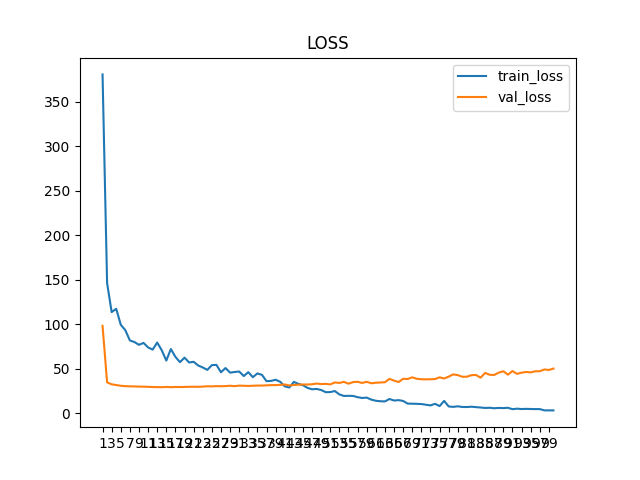

# 🤟 Continuous Sign Language Recognition (CSLR) Framework
# 基于深度学习的连续手语识别框架

本项目是一个完整、健壮且易于扩展的**连续手语识别（Continuous Sign Language Recognition, CSLR）**深度学习框架。项目基于 PyTorch 构建，支持多种前沿的手语识别架构（如 **VAC**, **TFNet**, **MSTNet** 等），并内置了针对手语数据的专门优化与预处理流水线。

## ✨ 核心特性 (Key Features)

*   **🏆 多模型架构支持**：内置主流 CSLR 模型，支持通过配置文件一键切换：
    *   `VAC` (Visual Alignment Constraint) - **[推荐 / 默认基线]** 稳定且高效的蒸馏模型。
    *   `TFNet` (Time-Frequency Network) - 时频双域特征融合网络。
    *   `MSTNet` (Multi-Scale Temporal Network) - 多尺度时空网络。
    *   `MAM-FSD` & `CorrNet` & `SEN` 等多种变体。
*   **🧠 知识蒸馏与对齐 (Knowledge Distillation & CTC)**：使用 CTC Loss 进行序列对齐，并结合 `SeqKD` (Sequence-level Knowledge Distillation) 让深层特征（BiLSTM）指导浅层视觉特征（1D-CNN）。
*   **🛡️ 手语专属数据增强 (Sign Language Specific Augmentation)**：
    *   内置 `TemporalRescale` (时间重采样) 模拟不同打手语的速度。
    *   标准的空间裁剪 (RandomCrop/CenterCrop) 与归一化。
    *   *注：严格移除了水平翻转 (Horizontal Flip) 以保留手语惯用手的严格语义。*
*   **⚖️ 分层学习率优化 (Layer-wise Learning Rate)**：对预训练的视觉骨干网络 (ResNet18/34) 应用 0.1 倍的学习率衰减，完美保护预训练权重，避免“灾难性遗忘”。
*   **🧹 智能标签清洗 (Robust Label Processing)**：内置正则表达式级的数据清洗，自动剥离所有影响模型收敛的标点符号，直击核心动作特征。
*   **📈 灵活的解码与评估**：
    *   支持 **Beam Search** (基于 `pyctcdecode`) 和 **Greedy Search** (Max)。
    *   内置精准的 **WER (Word Error Rate)** 计算工具，支持插入、删除、替换错误统计。

## 📁 目录结构 (Project Structure)

```text
├── BiLSTM.py              # BiLSTM 模块封装
├── CE-CSLDataPreprocessing.py # 视频抽帧预处理脚本
├── DataPreprocessing.py   # Dataset 定义、数据加载、标签清洗与 collate_fn
├── Module.py              # 视觉骨干网络 (ResNet 变体)、时序卷积 (TemporalConv)
├── Net.py                 # 核心网络组合 (ModuleNet)，拼接 CNN + 1DCNN + BiLSTM
├── Painting.py            # LOSS 与 WER 训练曲线可视化工具
├── SEN.py                 # 空间-时间增强网络 (SEN) 变体实现
├── Test.py                # 模型测试脚本与单视频翻译推理 (Translation)
├── Transformer.py         # 自定义 Transformer 编码器实现
├── VideoEnhancement.py    # 视频数据增强 (Crop, Resize, TemporalRescale)
├── WER.py                 # 字错误率 (Word Error Rate) 计算核心算法
├── config.py              # 基础配置文件 (字符映射等)
├── decode.py              # CTC 结果解码器 (Beam Search / Max Search)
├── readconfig.py          # 解析 params.ini 配置文件
├── train.py               # 模型训练主循环 (支持混合精度、梯度裁剪、Cosine Annealing)
├── params.ini             # [用户配置] 训练超参数与路径设置
└── README.md              # 项目说明文档
```

## ⚙️ 环境依赖 (Requirements)

- ### 1. 训练时采用的环境
  - #### 1. python环境： `PyTorch  2.8.0` `Python  3.12` `CUDA  12.8`
  - #### 2. 操作系统环境：`ubuntu22.04`（Windows操作系统上也可以正常运行）
  - #### 3. 计算机配置：GPU:`RTX 4090(24GB) * 1` cpu:`16 vCPU Intel(R) Xeon(R) Gold 6430`

- ### 2.建议使用 Python 3.8+ 及以上版本。主要依赖库：
  ```bash
  pip install torch torchvision
  pip install numpy pandas opencv-python imageio matplotlib tqdm loguru
  pip install pyctcdecode einops scipy
  ```
  
- ### 3. 如果你使用的时conda，可以使用一下方式来快速搭建环境
  ```bash
  conda env create -f environment.yml
  ```

## 🚀 快速开始 (Quick Start)

### 1. 数据准备
以 `CE-CSL` 数据集为例。首先使用抽帧脚本将原始视频转换为图片帧序列：
```bash
python CE-CSLDataPreprocessing.py -o ./CE-CSL/video -s ./data/video
```
或
```bash
python CE-CSLDataPreprocessing.py
```

确保你的数据目录和标签文件路径如下：
```text
./data/video/train/...
./data/video/dev/...
./CE-CSL/label/train.csv
./CE-CSL/label/dev.csv
```

### 2. 配置参数 (`params.ini`)
在项目根目录创建或修改 `params.ini` 文件。以下是推荐的稳定训练配置：

```ini
[Path]
trainDataPath = ./data/video/train
validDataPath = ./data/video/dev
testDataPath = ./data/video/test
trainLabelPath = ./CE-CSL/label/train.csv
validLabelPath = ./CE-CSL/label/dev.csv
testLabelPath = ./CE-CSL/label/test.csv
bestModuleSavePath = module/best.pth
currentModuleSavePath = module/current.pth

# 参数
[Params]
device = cuda
hiddenSize = 512
lr = 0.0001
batchSize = 2
numWorkers = 4
pinMemory = 1
moduleChoice = VAC
dataSetName = CE-CSL
```

### 3. 开始训练
直接运行训练脚本，模型会自动加载预训练的 ResNet 权重，并保存表现最好的模型到 `module/best.pth`。
```bash
python train.py
```
*训练结束后，会在 `Drawing_Results/` 目录下自动生成 LOSS 和 WER 的走势图。*

### 4. 测试与推理 (Inference)
如需在测试集上评估，或对单一手语视频进行翻译（识别），请运行：
```bash
python Test.py
```
`Test.py` 中的 `translation` 方法支持输入单一视频 `.mp4`，自动抽帧并输出手语翻译的中文句子。

## 📖 致谢与参考 (References)
*   **VAC**: Visual Alignment Constraint for Continuous Sign Language Recognition (ICCV 2021)
*   **pyctcdecode**: 感谢 Kensho 技术团队提供的 CTC 束搜索解码器。

***

## 🎫 结果
  - ### loss结果
    
    #### 结果分析：由于GPU价格的原因，我只采用了少部分的数据经行训练，train数据里面的数据过度缺少，导致validate上的许多词模型都没有接触过，所以导致了，这种现象的产生

***

## 💡 建议：
1. 拷贝代码,拷贝coco分支下的项目代码，其他分支下的代码存在错误，或是bug
    ```bash
    git clone -b coco https://github.com/xixihaianxian/Sign-Language-Recognition-ZN.git
   ```
   
## 🌸 申明
  - #### 代码纯属自己瞎改的，目前看来效果还是不错的，在训练集上，如果把一整套CE-CSL扔进去训练验证集的结果应该也不会差（我瞎猜的如果使用一整套房CE-CSL训练之后效果也不好的话，不要怪我🥺）
  - #### 源代码来自 https://github.com/woshisad159/TFNet